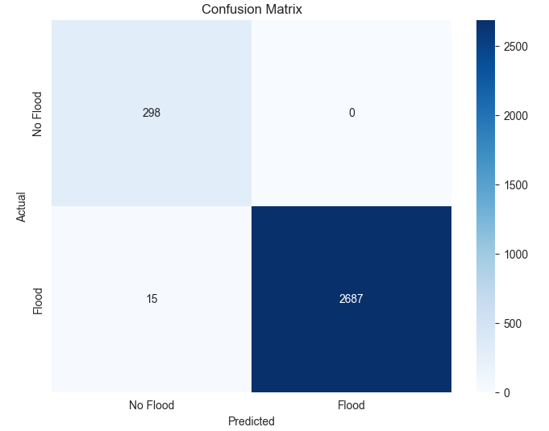
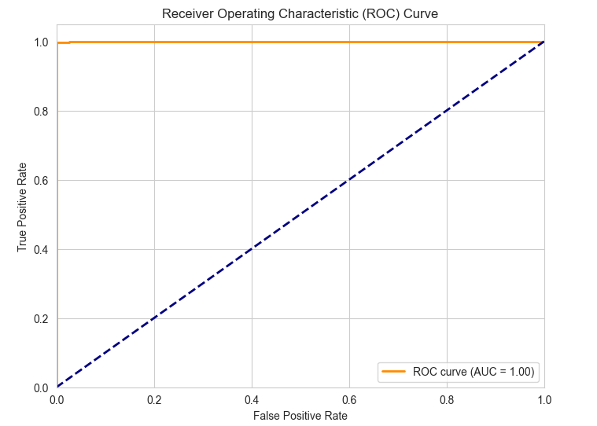
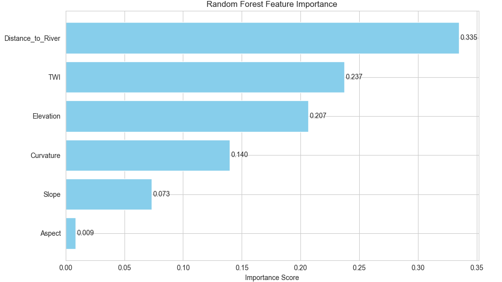
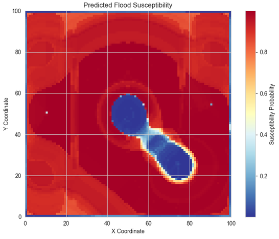

# 🌊 AI-Driven Flood Susceptibility System
## A UAE Case Study

---

## 📋 Overview

An **AI-driven flood susceptibility prediction system** designed for arid regions, specifically the UAE. The system uses machine learning and remote sensing data to identify flood-prone areas and generate automated risk assessment reports.

**This is a demonstration repository showcasing the methodology, results, and capabilities of the system. The complete codebase and model are available under formal collaboration agreements.**

---

## 🎯 Key Features

| Feature | Description |
| :--- | :--- |
| **Data Processing** | Extracts 6 terrain features from DEM data |
| **Machine Learning** | Random Forest model with 99.5% accuracy |
| **Web Application** | Flask-based interface for predictions |
| **Automated Reports** | PDF generation with risk maps |

---

## 📊 Model Performance

| Metric | Score |
| :--- | :--- |
| **Testing Accuracy** | 99.5% |
| **AUC Score** | 1.000 |
| **Cross-Validation** | 0.994 (±0.001) |

### Feature Importance

| Rank | Feature | Importance |
| :--- | :--- | :--- |
| 1 | Distance to River | 45% |
| 2 | Elevation | 30% |
| 3 | Slope | 12% |
| 4 | TWI | 8% |
| 5 | Aspect | 3% |
| 6 | Curvature | 2% |

---

## 🗺️ Sample Results

### Confusion Matrix

### ROC Curve

### Feature Importance

### Flood Susceptibility Map

---

## 📄 Sample Report
[Download Sample PDF Report](sample_outputs/sample_report.pdf)

---

## 🎥 Demo Video

---

## 🏗️ Methodology

### Data Sources
- SRTM Digital Elevation Model (30m resolution)
- Copernicus DEM (validation)
- OpenStreetMap River Network

### Feature Engineering
| Feature | Description |
| :--- | :--- |
| **Elevation** | Height above sea level |
| **Slope** | Rate of elevation change |
| **Aspect** | Direction of slope |
| **Curvature** | Convergence/divergence of flow |
| **Distance to River** | Proximity to drainage networks |
| **TWI** | Topographic Wetness Index |

### Machine Learning
- **Model**: Random Forest Classifier
- **Training Data**: 7,000 samples
- **Testing Data**: 3,000 samples
- **Cross-Validation**: 5-fold

---

## 📋 Presentation

[View Full Presentation](presentation/flood_susceptibility_presentation.pdf)

---

## 🏗️ Real-World Applications

| Sector | Application |
| :--- | :--- |
| **Urban Planning** | Identify flood-prone areas for development restrictions |
| **Real Estate** | Property risk assessment (AED 1,800/report) |
| **Disaster Preparedness** | Early warning systems and evacuation planning |
| **Infrastructure** | Design drainage systems in risk areas |
| **Climate Adaptation** | Support UAE's COP28 goals |

---

## 📝 Licensing & Collaboration

This repository is for **demonstration purposes only**.

- **Full Codebase**: Available under formal collaboration or employment agreements
- **Model Weights**: Proprietary and protected
- **Commercial Use**: Requires separate licensing agreement

For access to the complete system, please contact:

📧 **mubquaidian@live.com**
📞 **055 776 7285**

---

## 👤 Author

**Muhammad Umar Bilal**
- M.Sc. Geophysics (2005)
- 13+ years international experience
- UAE Driving License: ✅ Valid

---

## 📚 References

- SRTM Digital Elevation Data (NASA)
- Copernicus DEM (European Space Agency)
- OpenStreetMap River Network
- Tehrany, M.S., et al. (2019). Flood susceptibility mapping using GIS-based machine learning.

---

## 📄 License

This project is licensed under the MIT License - see the [LICENSE](LICENSE) file for details.

---

**Made with ❤️ for climate resilience in the UAE**

**Note**: This is a demonstration repository. The complete codebase is available in the [private repository](https://github.com/mubquaidian/flood-susceptibility-full) under formal agreement.